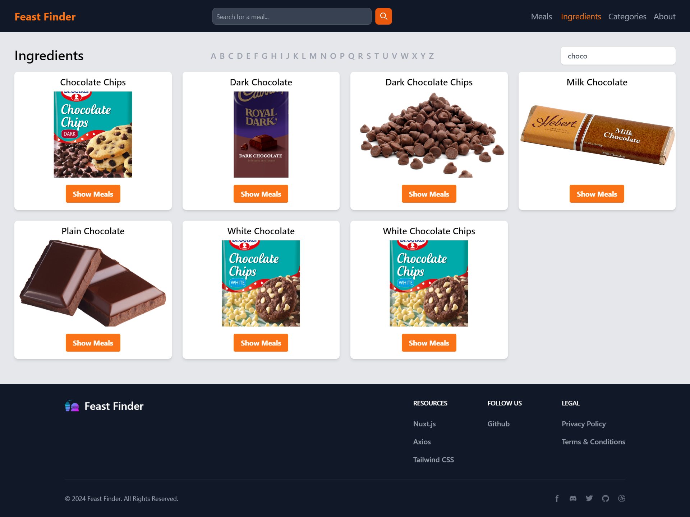
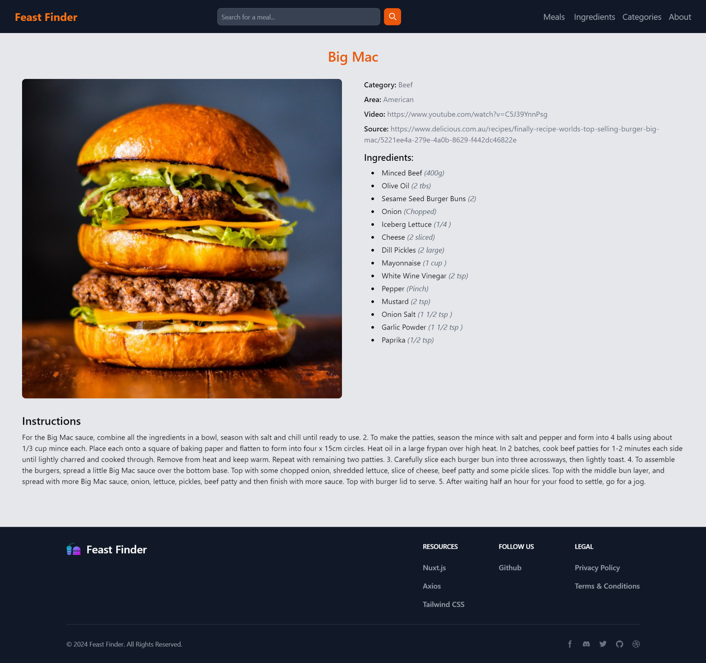

# Feast Finder

Feast Finder is a web application that allows users to search for meals based on their ingredients and food categories. Users can also view details about a specific meal, including its ingredients and instructions on how to prepare it. The application uses the [MealDB API](https://www.themealdb.com/api.php) to fetch meal data.

## Features

- Search for meals based on ingredients and food categories
- View details about a specific meal, including its ingredients and instructions
- Filter results by search query or first letter of meal name
<!-- - Save meals to a favorites list -->

## Examples

### Home Page

### Search by Ingredient

## Meal Details

## Technologies

- Nuxt.js
- Tailwind CSS
- Axios

## Setup

1. Clone the repository
2. Install dependencies with `npm install`
3. Run the application with `npm run dev`
