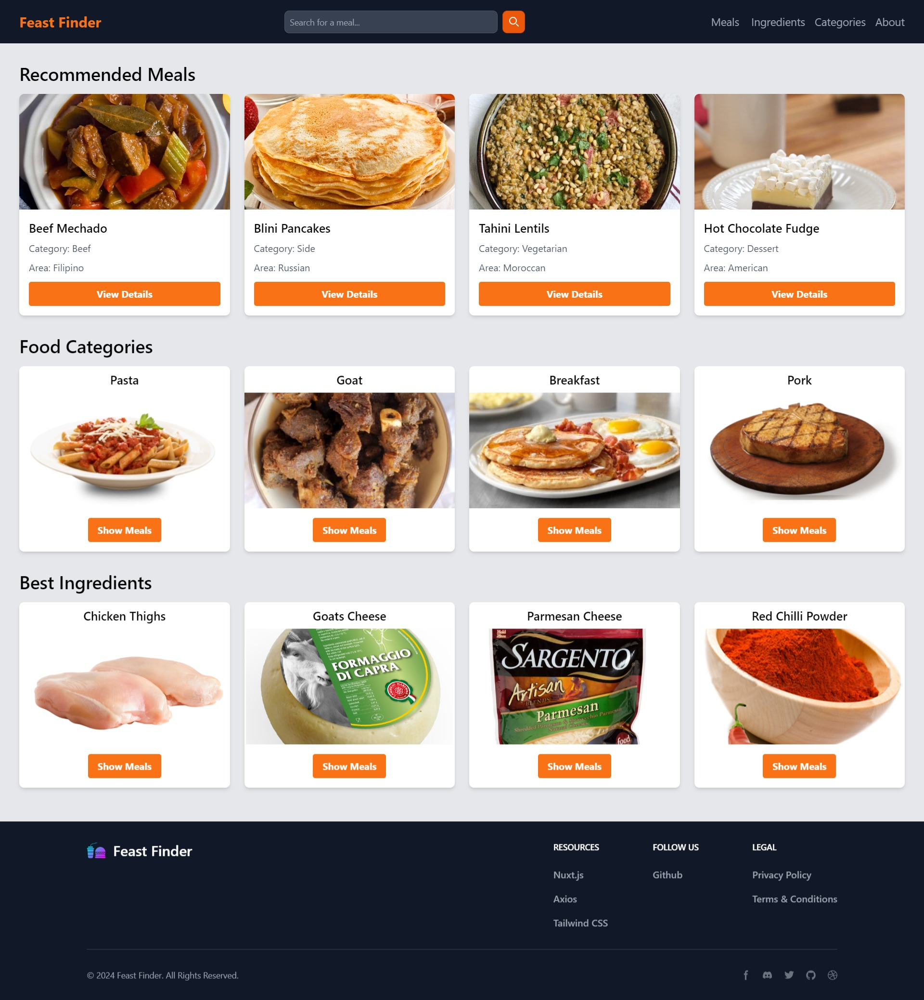
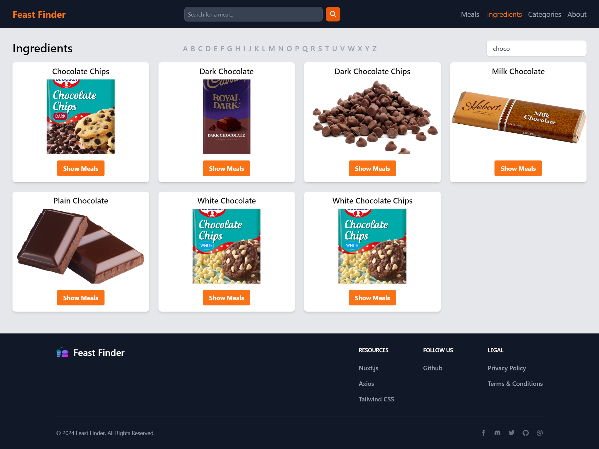
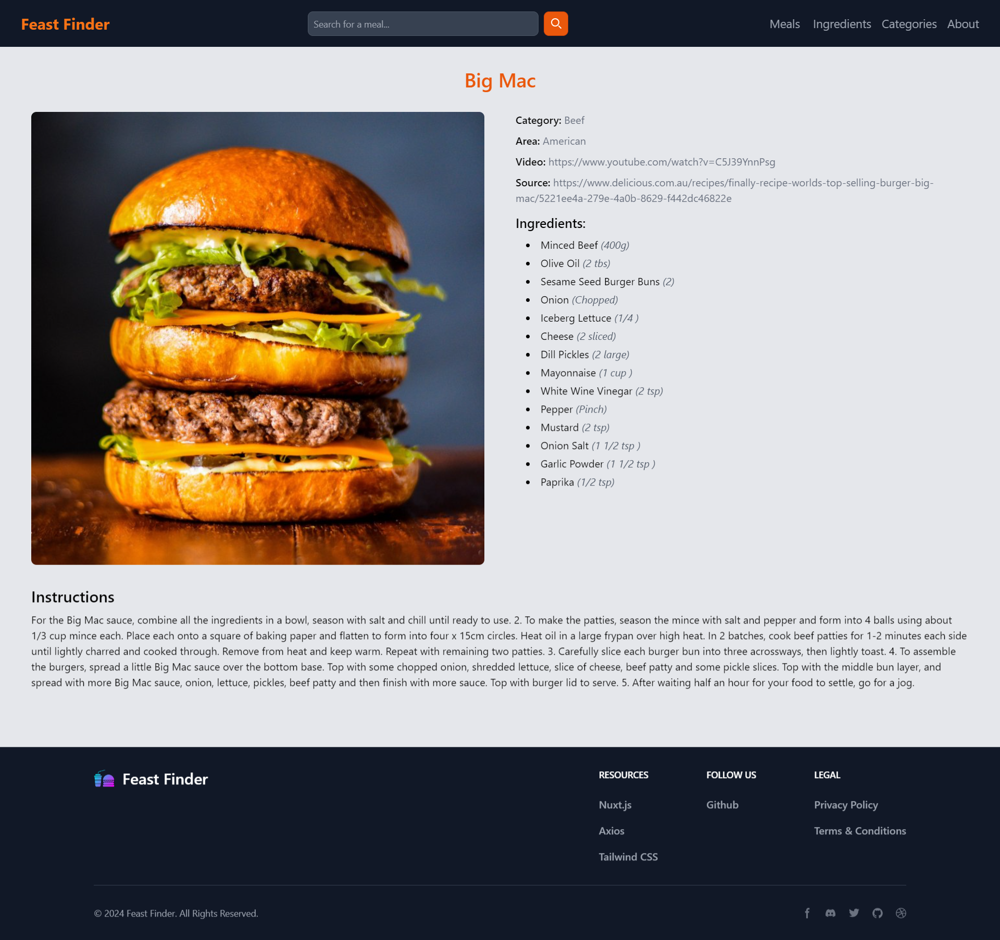

# Feast Finder

[](https://github.com/AkosKappel/FeastFinder/actions/workflows/nuxtjs.yml)


Feast Finder is a web application for finding recipes by meal name, ingredient or food category. Each meal shows its ingredients, step-by-step instructions and a video when available. Recipe data comes from [TheMealDB API](https://www.themealdb.com/api.php).

**Live demo:** https://akoskappel.github.io/FeastFinder/

## Features

- Search meals by name or browse them by first letter, category, ingredient or cuisine (63 countries with flags), or get a random meal
- What's in my fridge: pick several ingredients and find meals that use all of them, or all but one
- Meal pages with ingredient images, numbered steps and the embedded cooking video
- Read the instructions aloud (Web Speech API), with the current step highlighted
- Favourites saved in the browser, sharing via the Web Share API or the clipboard, print-friendly recipes, keep the screen on while cooking (Screen Wake Lock API)
- Ingredient filter by name and first letter, kept in the URL
- Loading skeletons, error states with retry, offline notice, a 404 page, keyboard and screen reader friendly, works on phones

## Examples

### Home Page



### Search by Ingredient



### Meal Details



## Tech stack

- [Nuxt 4](https://nuxt.com/) with Vue 3 and TypeScript, rendered in the browser as a static single-page app
- [Tailwind CSS](https://tailwindcss.com/) for styling, [Lucide](https://lucide.dev/) icons
- [VueUse](https://vueuse.org/) for browser APIs (local storage, share, clipboard)
- [Vitest](https://vitest.dev/) unit tests, [Playwright](https://playwright.dev/) end-to-end tests with [axe](https://github.com/dequelabs/axe-core) accessibility checks, Prettier for formatting
- GitHub Actions and GitHub Pages for CI and hosting

API responses are cached in memory for 30 minutes and identical requests are merged, so browsing back and forth does not call the API again. At build time a script also collects every meal into a small index (`public/data/meals.json`, about 50 kB compressed). Browsing by letter or country, searching and the fridge run on this index, because the free API cannot filter by several ingredients and many meals have no area set.

## Getting started

Requires Node.js 22 or 24.

```bash
npm install
npm run dev
```

| Script                | What it does                                                       |
| --------------------- | ------------------------------------------------------------------ |
| `npm run dev`         | Start the development server on http://localhost:3000/FeastFinder/ |
| `npm test`            | Run the unit tests                                                 |
| `npm run test:e2e`    | Run the end-to-end tests against the generated site                |
| `npm run typecheck`   | Type-check the project                                             |
| `npm run format`      | Format the code with Prettier                                      |
| `npm run generate`    | Build the meal index and the static site into `.output/public`     |
| `npm run data:update` | Rebuild the meal index (`public/data/meals.json`)                  |

## Deployment

Every push to `main` and a weekly schedule run [the workflow](.github/workflows/nuxtjs.yml): format check, type check, unit tests, `nuxt generate` with the `github_pages` preset, end-to-end tests, then deployment to GitHub Pages. The generated `404.html` loads the app for any path, so links to meals, categories and ingredients work directly.

## Credits

Recipe data and images: [TheMealDB](https://www.themealdb.com/), using its free test API key for educational use.
