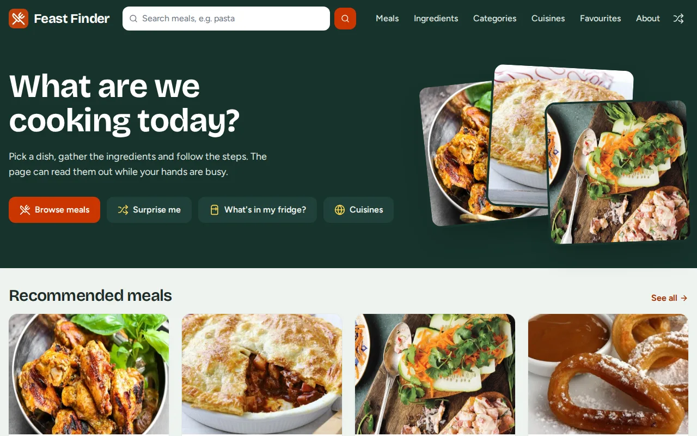
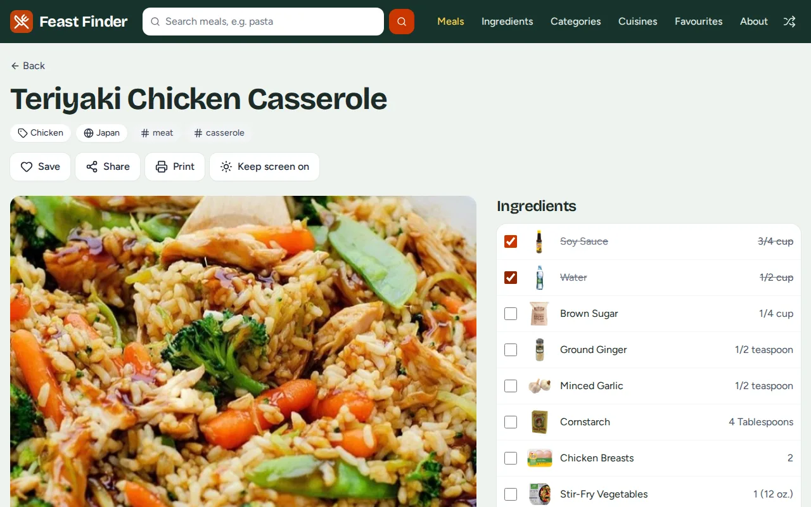
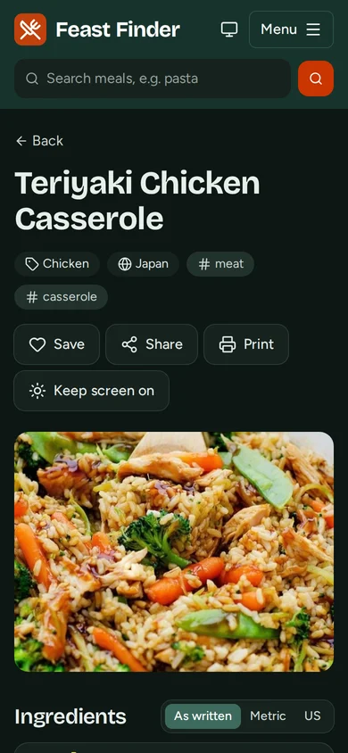
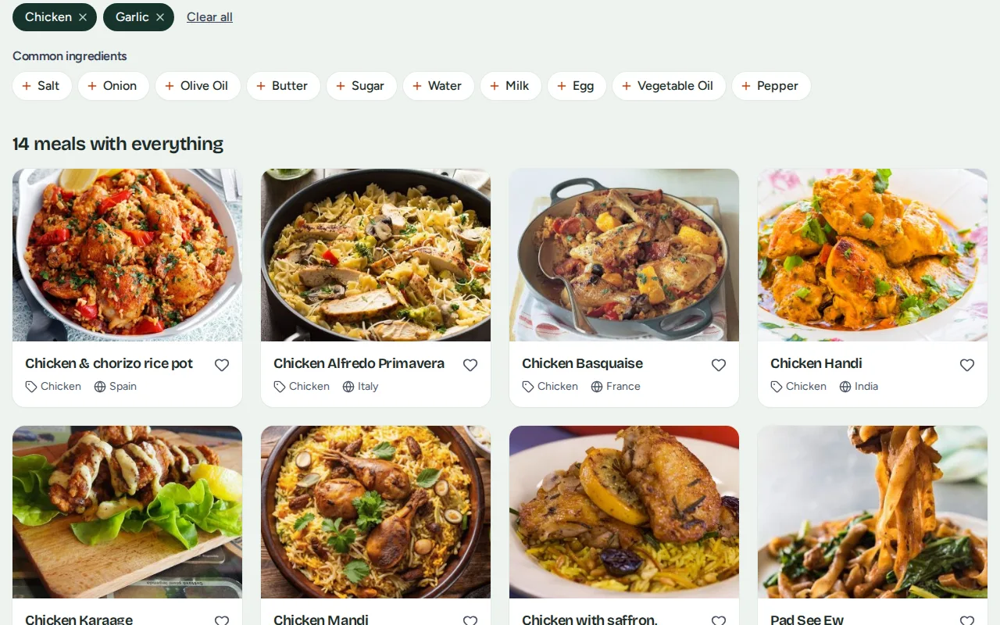

# Feast Finder

[](https://github.com/AkosKappel/FeastFinder/actions/workflows/nuxtjs.yml)
[](LICENSE)


Feast Finder is a web application for finding recipes by meal name, ingredient, food category or cuisine. Each meal shows its ingredients, step-by-step instructions and a video when available. Recipe data comes from [TheMealDB API](https://www.themealdb.com/api.php).

**Live demo:** https://akoskappel.github.io/FeastFinder/



## Features

- Search meals by name or browse them by first letter, category, ingredient or cuisine (63 countries with flags), or get a random meal
- What's in my fridge: pick several ingredients and find meals that use all of them, or all but one
- Meal pages with ingredient images, numbered steps and the embedded cooking video
- Cooking checklist: tick off ingredients and steps, keep the screen on (Screen Wake Lock API) and have the instructions read aloud (Web Speech API) with the current step highlighted
- Favourites saved in the browser, sharing via the Web Share API or the clipboard, print-friendly recipes
- Works offline for pages and recipes you have opened before, and can be installed as an app
- Filters, letters and pages kept in the URL, loading skeletons, error states with retry, a 404 page
- Keyboard and screen reader friendly (Lighthouse accessibility 100), works on phones

| Meal page                             | On a phone                                             |
| ------------------------------------- | ------------------------------------------------------ |
|  |  |



## Tech stack

- [Nuxt 4](https://nuxt.com/) with Vue 3 and TypeScript, rendered in the browser as a static single-page app
- [Tailwind CSS 4](https://tailwindcss.com/) with the theme defined in CSS, [Lucide](https://lucide.dev/) icons, self-hosted fonts from [Fontsource](https://fontsource.org/)
- [VueUse](https://vueuse.org/) for browser APIs (local storage, share, clipboard, wake lock, online status)
- [Vitest](https://vitest.dev/) unit tests, [Playwright](https://playwright.dev/) end-to-end tests with [axe](https://github.com/dequelabs/axe-core) accessibility checks, ESLint and Prettier
- GitHub Actions and GitHub Pages for CI and hosting

## How it works

- **Data:** API responses are cached in memory for 30 minutes and identical requests are merged, so browsing back and forth does not call the API again. At build time a script also collects every meal into a small index (`public/data/meals.json`, about 50 kB compressed). Browsing by letter or country, searching and the fridge run on this index, because the free API cannot filter by several ingredients and many meals have no area set.
- **Offline:** a small service worker (`public/sw.js`) keeps the app shell, built assets, recipe data and images, so pages you have visited open without a connection.
- **Hosting:** GitHub Pages serves static files only. Every meal, category and cuisine gets a prerendered copy of the app shell, so their links return 200 and can be indexed; other paths load the app from `404.html`.
- **SEO:** canonical URLs, page descriptions, `Recipe` structured data on meal pages, a sitemap built with the meal index, and a link preview image.

## Getting started

Requires Node.js 22 or 24.

```bash
npm install
npm run dev
```

| Script                | What it does                                                         |
| --------------------- | -------------------------------------------------------------------- |
| `npm run dev`         | Start the development server on http://localhost:3000/FeastFinder/   |
| `npm run lint`        | Lint the code with ESLint                                            |
| `npm run typecheck`   | Type-check the project                                               |
| `npm test`            | Run the unit tests                                                   |
| `npm run test:e2e`    | Run the end-to-end tests against the generated site                  |
| `npm run format`      | Format the code with Prettier (`format:check` only checks)           |
| `npm run generate`    | Build the meal index, the sitemap and the static site into `.output` |
| `npm run data:update` | Rebuild the meal index and the sitemap                               |

## Testing

- **Unit tests** (`test/unit`, Vitest): helpers, the API client with mocked responses, the meal index search and the SEO data.
- **End-to-end tests** (`test/e2e`, Playwright): run on the generated site, served the way GitHub Pages serves it, in a desktop and a phone browser. TheMealDB is mocked, so the tests are fast and stable. They cover search, meal pages, favourites, the fridge, paging, error and 404 states, and run axe accessibility checks, also with the operating system in dark mode.

```bash
npm run generate
npx playwright install chromium
npm run test:e2e
```

## Deployment

Every push to `main` and a weekly schedule run [the workflow](.github/workflows/nuxtjs.yml): format check, lint, type check, unit tests, `nuxt generate` with the `github_pages` preset, end-to-end tests, then deployment to GitHub Pages. The weekly run refreshes the meal index with new recipes.

## Credits

Recipe data and images: [TheMealDB](https://www.themealdb.com/), using its free test API key for educational use.

## License

[MIT](LICENSE) © Ákos Kappel
